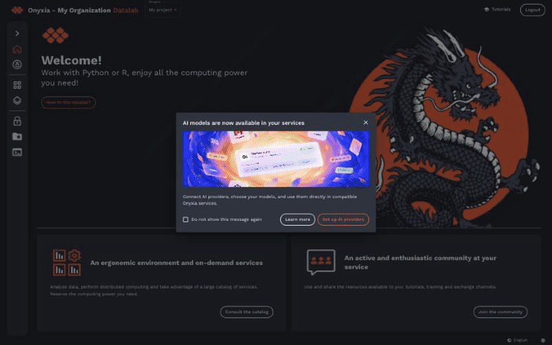

# onyxia-ai-annoncement

Onyxia plugin announcing the AI feature:

- a release dialog shown to logged in users when they arrive on Onyxia, until they close it
  (for good if they tick "Do not show this message again");
- a notice at the top of the launcher form, with a link to the AI tab of the account page and
  a button that scrolls to and opens the "AI Assistant" group, along with a "New" badge on
  that group; both go away when the user dismisses the notice.

What the user has seen is stored in `localStorage`. The plugin does nothing after
`ANNOUNCEMENT_END_DATE` (see `src/main.ts`).



## Development

```bash
git clone https://github.com/InseeFrLab/onyxia
cd onyxia/web
yarn
git clone https://github.com/onyxia-datalab/onyxia-ai-annoncement onyxia-ai-announcement
cd onyxia-ai-announcement
npm install
npm run dev
# OPTIONAL: Check if the code is sound, typewise:
npm run typecheck
```

> NOTE: `npm run dev` overwrites `web/.env.local.yaml` with `./.env.local.yaml`.

## Production Build

```bash
npm install
npm run build # Generate ./onyxia-ai-announcement.zip
```

`apps/onyxia/values.yaml`

```yaml
onyxia:
    web:
        env:
            CUSTOM_RESOURCES: "<https url to onyxia-ai-announcement.zip>"
            CUSTOM_HTML_HEAD: |
                <script src="%PUBLIC_URL%/custom-resources/js/index.mjs?v=1" type="module"></script>
```
